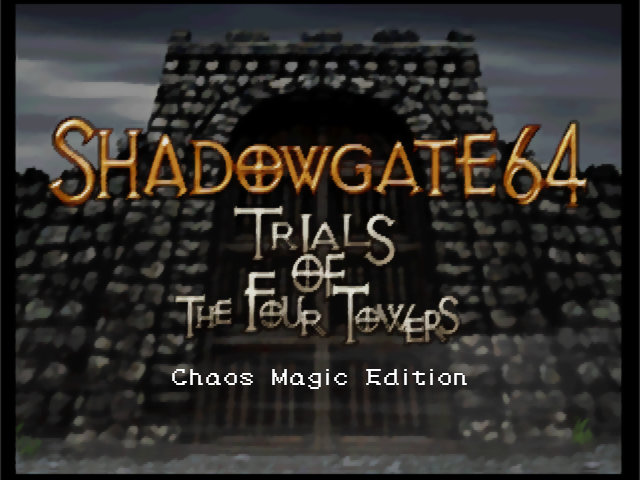
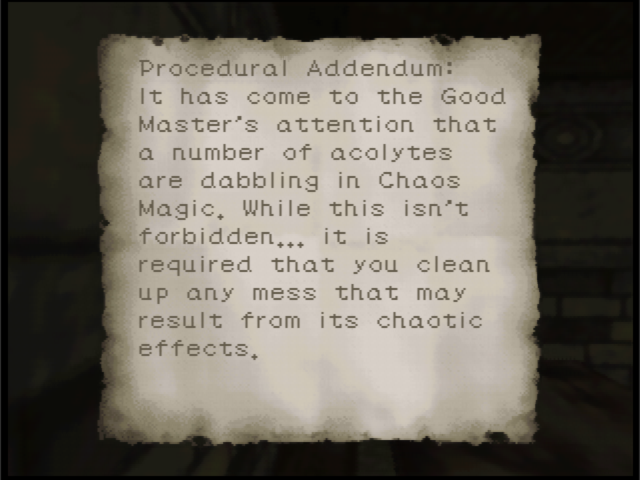
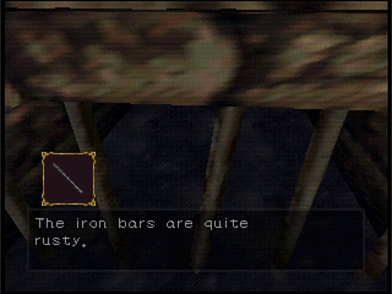
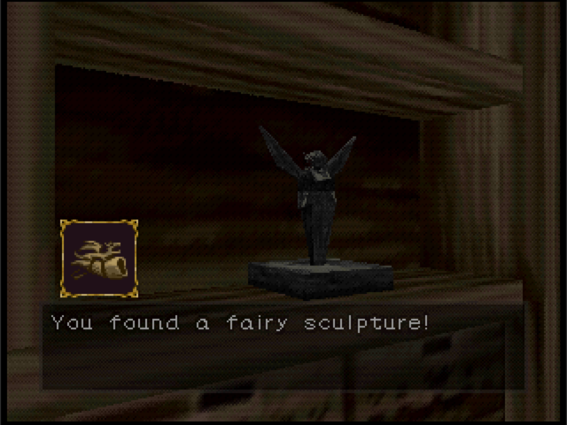

# Shadowgate 64 Chaos Magic Edition Randomizer

This program will modify a user-provided ROM of [Shadowgate 64](https://en.wikipedia.org/wiki/Shadowgate_64:_Trials_of_the_Four_Towers) to enable item randomization.  These modifications include careful code edits/additions, a shuffled item look-up table, and updates to the ROM header checksums for a total of around 300 bytes.

## What is a randomizer?
* Randomizers are a great way to breathe new life into your favorite video games by shuffling items, enemies, and/or doors while maintaining gameplay logic so that the game can still be completed.
* [Pokémon](https://github.com/Ajarmar/universal-pokemon-randomizer-zx), [Mario 64](https://romhacking.com/hack/sm64-randomizer), [Ocarina of Time](https://ootrandomizer.com), [Resident Evil](https://biorand.net), [Dark Souls](https://www.nexusmods.com/darksouls/mods/1407), and many, many other games have amazing randomizers.
* Resident Evil 2 for the N64 actually had a built-in randomizer in 1999!

## Features
* Deterministic randomization seeds, so the same seed will always generate the same experience.
* Items are shuffled with gameplay logic in place, so they will always be available before required for progression.
* Four different book shuffling modes:
    * Static books
        * The location of every book is unchanged.
    * Shuffle books separately
        * A book will always be a book, but each book is shuffled with gameplay logic.
    * Shuffle books
        * An item may become a book and vice versa.
    * Shuffle books without logic
        * Gameplay logic will not be applied to book shuffling, allowing for more varied results.  This mode may not provide information before it is necessary for progression and is intended for players who are already familiar with the game's puzzles.

## Gameplay Experience
* Some items appear in their usual locations.

* Other items appear in unexpected places.

* As you can see, only the item icon will show the updated item.  The in-world model and text description will remain unchanged, to minimize the number and complexity of changes necessary for the randomizer.
* Once an item is in your inventory, it will appear and behave as usual.

## Requirements
* Shadowgate 64 USA ROM
    * Please provide your own BigEndian/z64 format backup.
    * Title Identifier: NSGE
    * [no-intro record](https://datomatic.no-intro.org/index.php?page=show_record&s=24&n=0661)
    * Additional region support will be added in a future update.
    * Prototype ROMs are unlikely to ever be supported.
* [make](https://www.gnu.org/software/make/)
* [clang](https://clang.llvm.org)

## Building
* Simply run `make` from inside the project directory.
* Depending on your operating system, a `bin/*/sg64rando` executable will be created.
* Alternatively, prebuild binaries and select patches are available in [Releases](https://github.com/grendell/sg64rando/releases).

## Running
* Example usage:  `bin\win\sg64rando.exe NSGE.z64 3 0xdecafbad`
    * Shuffle modes
        * 1: Static books
        * 2: Shuffle books separately
        * 3: Shuffle books
        * 4: Shuffle books without logic
        * Defaults to "3: Shuffle books" if omitted.
    * Seed:
        * Must be an unsigned hexadecimal number within 1 - ffffffff.
        * 0x prefix is optional.
        * Defaults to the current time if omitted.

## Output
* A modified ROM with the shuffling mode and seed in the file name.
* A text report detailing all replacements.
    * For example, "Fairy Statue -> Dragon Flute"

## How It Works
* Items are laid out in a dependency graph according to gameplay logic and then shuffled following those rules.
* When the game interacts with an item, new logic is applied to decide whether or not to override that item with the shuffled item.
    * Override the item icon displayed.
        * Exception:  skip when in the Dungeon, to prevent shuffling the Orb icon when handing it to Agaar.
    * Override the in-world item pick-up.
    * Override the item status update.
        * Example:  Jezibel gives you her "Pendant."
        * Items have a status bitfield, for states such as equipped, placed in the world, and in the player's inventory.
        * Exception:  skip when update is "clear status", equip, or place.
        * Exception:  skip when in the Destroyed Park or Disciples' sliding bookshelf room, to prevent shuffling when retrieving the Ring of the Kingdom and Statues/Sculptures.
    * Override the item status check.
        * Example:  Jezibel will only release the "Family Diary" once you have received her "Pendant."
        * Exception:  skip when check is "clear status" (for consistency), "is equipped", or "is placed."
        * Exception:  skip when in Disciples' Foyer, Keeper's Room, and Trials Crest Room to prevent shuffling when checking for the Ring of the Dead, Orb, and Fragments of a Crest, respectively.

## Limitations (Spoilers!)
* Some items are not allowed to be shuffled, to avoid soft-locks or hangs.
    * Slipper and Dirty Slipper
        * These interactions have hardcoded checks for the other, in case combining into the Pair of Slippers is required.  Updating these checks is possible, but provides minimal variation.  Always applying this check on item pick-up could be considered in a future update.
    * Pair of Slippers
        * Similarly, the Pair should only ever result from the combination check.
    * Staff of Ages
        * Configuration changes for the village and Castle Gate are always applied when the player possesses the Staff of Ages, creating several potential soft-locks when navigating the village.
        * Configuration changes for the arrival of Belzar cutscene cause the game to hang if the Castle Gate changes are also applied.
    * Burning Candle
        * The Candle must be available to pick up again if the player runs out of time in the Trials Maze.
    * Violins
        * Since the Violins all share the same icon, they would be indistinguishable before pick-up.  They remain static to avoid player frustration.
    * Water and Water w/ Dragon Tears
        * Replacing the Mug with something other than Water could prevent reusing it for the Water w/ Dragon Tears later and might be confusing for the player.
    * Lost Coin
        * The fifth coin is not normally accessible in the game.  Since an item shuffled into this location would be inaccessible, consistency with the original experience was chosen.
* Some items are not allowed to be replaced with a critical item, because sequence breaks allow them to be permanently lost.
    * Star Crest
        * The Star Crest will be removed from the door upon completion of the fireplace puzzle.
    * Cup
        * Since there are only four coins available, Festus' Shoppe cannot contain five critical items.
    * Stone of Thirst
        * Draining the Waterway before sending Kaitlin home will prevent Dorn from giving you the Stone of Thirst.
    * Lever
        * The Lever will be removed from Agaar's Room upon snapping it into place in the Control Room.

## Known Issues
* It is possible to soft-lock in the final room of the Trials Tower if the player enters without the Ring of the Kingdom.
* If the Lever was not retreived from Agaar's Room before snapping it into place in the Control Room, it will visually disappear.  The player can still operate the mechanism, and the lever will reappear if the player leaves the room and returns.

## Bug Reports
* Please first consult the generated report to confirm you didn't overlook an item.  This is easy to do in a randomizer!
* If things still seem wrong, create an [Issue](https://github.com/grendell/sg64rando/issues), providing as much detail as possible.  At a minimum, include your shuffling mode and seed, as well as a description of the situation.
* Thank you for helping improve this project!

## This project was made possible by...
* Infinite Ventures, TNS Co. Ltd., and Kemco Co. Ltd.
    * [Zojoi](https://www.zojoi.com):  Shadowgate 64 Reimagined?  [Call me.](https://bsky.app/profile/grendell.bsky.social)
* [Project64](https://www.pj64-emu.com):  emulator and developer tools
* [Ghidra](https://github.com/NationalSecurityAgency/ghidra):  reverse engineering tools
* [Warranty Voider](https://github.com/zeroKilo/N64LoaderWV):  N64 ROM loader for Ghidra
* [Andreas Sterbenz](https://github.com/DragonMinded/libdragon/blob/f43ba72c035f27fff894df44b2453e9d346c3c9a/tools/chksum64.c):  chksum64
* [Analog Devices](https://www.analog.com/en/resources/design-notes/random-number-generation-using-lfsr.html):  LFSR reference
* [notwa](https://gist.github.com/notwa/5689243):  tiny crc32
* [Encryption 64](https://en64.shoutwiki.com/wiki/ROM#Cartridge_ROM_Header):  N64 ROM header documentation
* My wife:  the brilliant suggestion of leveraging the current room ID 😁